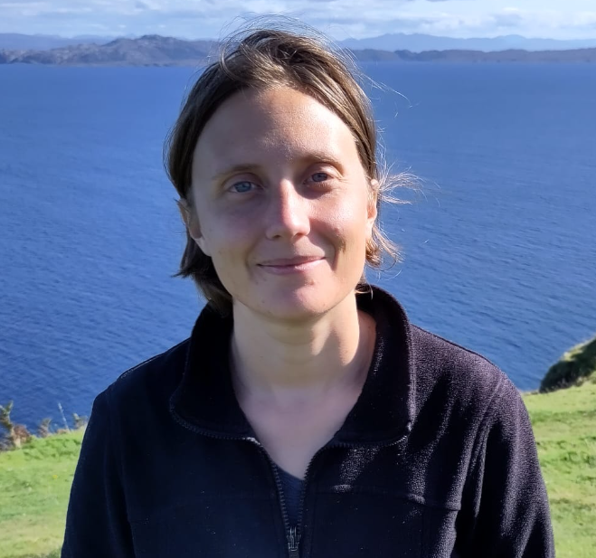

@def title = "Marta Vanin - Homepage"
@def hasmath = false
@def hascode = false
@def tags = ["about", "work"]

# About me

~~~

  

    
~~~
@@inline-images
I am an incoming assistant professor in the [Electa](https://www.esat.kuleuven.be/electa) group of the [KU Leuven - Technologiecampus Gent](https://www.kuleuven.be/gent/industrieel-ingenieur),
which is part of the department of electrical engineering [(ESAT)](https://www.esat.kuleuven.be) of KU Leuven, as well as [EnergyVille](https://energyville.be/).   
Prior to that, I have been a postdoc and a PhD student at Electa (Leuven) and EnergyVille, in prof. [Dirk Van Hertem](https://www.esat.kuleuven.be/electa/professors/00043846)'s group. 
During my PhD and postdoc time, I visited the Zuse Institute in Berlin, Germany, and CSIRO Energy in Newcastle (NSW), Australia, for a few months.
@@
~~~
    

  

~~~

# Work together?

> :loudspeaker:   **I have an opening for a Ph.D. student !!**

Have a look at my research activities below and do not hesitate to contact me if you they pique your interest.

# Research 

### General interests

I (help) develop computational tools and methods that entail (electricity) distribution system modelling and optimization.

My main research interests include, but are not limited to: 
- system monitoring, through _state estimation_, 
- system identification/parameter estimation 
either in (near-)real-time or with historical data, as well as:
- the role/impact of the above in a broader active distribution network context (e.g., for flexibility, improved network management, etc.)

In the past, I have worked on methods for both system operation and planning, and "digital twins". Check my publications (see below) for a better overview of my research activities/expertise.

Note that the list above is not exhaustive, so if you would like to collaborate on something, or if you would like to do a PhD with me, just send me an e-mail to check mutual interest on the topic and time availbility.

### Projects

A list of projects for which I am (co-)PI and/or (co-)supervise doctoral students is available on [this portal](https://research.kuleuven.be/portal/en/user/U0122389).

Other projects I contribute(d) to, in different capacity:
* [ADriaN](https://energyville.be/en/project/adrian-active-distribution-networks/) 
* [FlexIQ](https://research.kuleuven.be/portal/en/project/3E240512)
* [DIRECTIONS](https://research.kuleuven.be/portal/en/project/3E221197)
* [IMPROCAP](https://www.improcap.eu/)

# Publications

Check [Google Scholar](https://scholar.google.com/citations?user=D-5tDxoAAAAJ&hl=it) and KU Leuven's [Lirias](https://lirias.kuleuven.be/cv?Username=u0122389).

# Contacts

You can reach out by email at: _marta_[dot]_vanin_[you know what]_kuleuven_[dot]_be_

I am also on LinkedIn, etc., but I am not necessarily very active/responsive there.
